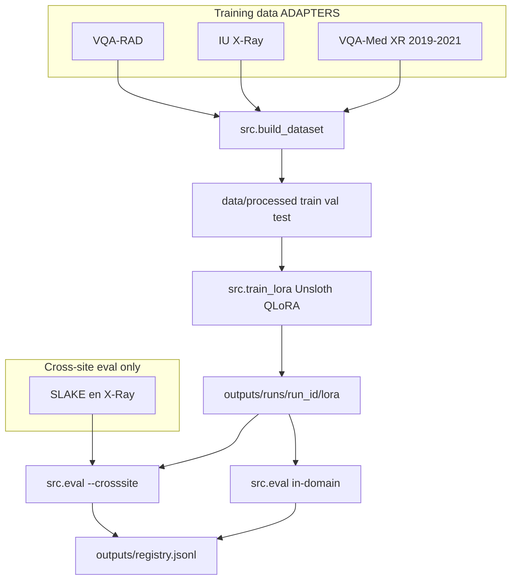

# VQA Finetuning Project — Development Report

**Generated:** 2026-07-12  
**Repository:** `vqa-finetuning`  
**Best in-domain VQA run:** [`full-Qwen3VL4BInstruct-r16-20260708-170640`](outputs/runs/full-Qwen3VL4BInstruct-r16-20260708-170640) (VQA-RAD + IU X-Ray)  
**Latest 3-source run:** [`full-Qwen3VL4BInstruct-r16-20260709-142243`](outputs/runs/full-Qwen3VL4BInstruct-r16-20260709-142243) (VQA-RAD + IU X-Ray + VQA-Med XR)

---

## 1. Executive summary

This project finetunes **Qwen3-VL-4B-Instruct** with **Unsloth QLoRA** for chest X-ray **Visual Question Answering (VQA)** and **report generation** using a portable, config-driven pipeline on WSL with dual 12 GB GPUs.

Development to date includes:

- End-to-end pipeline (data import → unified JSONL → LoRA training → in-domain eval → model registry)
- **Three training datasets** integrated via pluggable adapters
- **One held-out cross-site dataset** (SLAKE) for external generalization testing
- Automated experiment tracking (`outputs/registry.jsonl`, `outputs/leaderboard.md`)
- Post-training hooks for in-domain eval (`--eval-after`) and cross-site eval (`--crosssite-after`)

### Current status (as of 2026-07-12)

| Run | Sources | VQA acc | VQA F1 | Report BLEU / ROUGE-L | SLAKE cross-site | Role |
|-----|---------|---------|--------|----------------------|------------------|------|
| **`…170640`** (Jul 8) | `vqa_rad`, `iu_xray` | **0.5499** | **0.3800** | 0.0743 / 0.2656 | Not run | **Best in-domain VQA** |
| **`…142243`** (Jul 9) | + `vqa_med` | 0.4109 | 0.2523 | 0.0746 / 0.2651 | **0.3944** (base 0.5410) | Latest 3-source; broader but weaker |

**Key finding:** Adding incomplete VQA-Med (missing 2020 AIcrowd train zip) lowered headline VQA accuracy by ~14 pp versus the Jul 8 2-source run. Report metrics stayed essentially unchanged. On SLAKE, fine-tuning *hurt* generalization (−14.7 pp vs frozen base). Use Jul 8 for VQA-RAD work until VQA-Med data is complete.

Processed data is still `data_version: 2e673c1d` (rebuild on 2026-07-09 confirmed identical counts; **2020 train still skipped**).

---

## 2. System architecture



**Design principles:**

| Principle | Implementation |
|-----------|----------------|
| Pluggable sources | `src/datasets_registry.py` — `ADAPTERS` (training) vs `CROSSSITE_ADAPTERS` (eval-only) |
| No data leakage | Official splits honored; `study_id`-level carving; frozen `data_version` hash on test set |
| Comparable benchmarks | Baseline cached per `(base_model, data_version)`; deltas logged in registry; prefer `vqa_acc_by_source` when test mix changes |
| Portability | Relative paths, HF cache under `data/hf_cache/`, WSL-compatible (`UNSLOTH_COMPILE_DISABLE`) |

---

## 3. Development timeline

| Phase | Deliverable | Status |
|-------|-------------|--------|
| **1. Scaffold** | Repo layout, `requirements.txt`, `configs/train.yaml`, `src/` + `scripts/` | Done |
| **2. Environment** | `scripts/setup_env.sh` — venv, CUDA torch, Unsloth on WSL | Done |
| **3. Data adapters** | `load_vqa_rad`, `load_iu_xray` → unified JSONL schema | Done |
| **4. Dataset builder** | `src/build_dataset.py` — splits, `stats.json`, `data_version` | Done |
| **5. Training** | `src/train_lora.py` — QLoRA via `FastVisionModel` + `SFTTrainer` | Done |
| **6. Evaluation** | `src/eval.py` — VQA acc/F1, report BLEU/ROUGE-L, baseline comparison | Done |
| **7. Model registry** | `src/registry.py`, `scripts/leaderboard.py`, per-run artifact dirs | Done |
| **8. Smoke validation** | `scripts/run_smoke.sh` — 200-sample end-to-end on GPU 0 | Done |
| **9. Full training run (2-source)** | `full-…-170640` on 3,688 train rows — **best VQA to date** | Done |
| **10. Cross-site eval** | SLAKE pipeline (`src/build_crosssite.py`, `scripts/eval_crosssite.sh`) | Done |
| **11. VQA-Med integration** | `src/vqa_med_io.py`, `load_vqa_med`, chest X-ray filter, 3rd training source | Done (partial: no 2020 train) |
| **12. Task balancing** | `balance_tasks: true` — 60/40 VQA/report mix on full training | Done |
| **13. Full training run (3-source)** | `full-…-142243` on 4,725 train rows + SLAKE cross-site | Done |
| **14. Rebuild / probe** | Re-download + rebuild (`2e673c1d`); confirmed 2020 train still missing | Done (no new data) |

---

## 4. Datasets

### 4.1 Training datasets (3 sources)

These are registered in `ADAPTERS` and flow into `data/processed/{train,val,test}.jsonl`.

| # | Source key | Dataset | Task | Access | Filter / notes |
|---|------------|---------|------|--------|----------------|
| 1 | `vqa_rad` | [VQA-RAD](https://huggingface.co/datasets/flaviagiammarino/vqa-rad) | VQA | Open | Radiology Q&A; official train/test |
| 2 | `iu_xray` | [IU X-Ray](https://huggingface.co/datasets/dz-osamu/IU-Xray) | Report | Open | Chest X-ray findings; zip/image fallback |
| 3 | `vqa_med` | ImageCLEF VQA-Med 2019–2021 | VQA | Open | **Chest X-ray / plain film only**; 2020 train via AIcrowd zip (**still missing**) |

#### Current processed split (`data_version: 2e673c1d`)

| Split | Total | VQA-RAD | IU X-Ray | VQA-Med XR |
|-------|-------|---------|----------|------------|
| **Train** (raw JSONL) | 4,904 | 1,619 | 2,069 | 1,216 |
| **Val** | 752 | 174 | 296 | 282 |
| **Test** | 1,179 | 451 | 590 | 138 |
| **Total** | 6,835 | 2,244 | 2,955 | 1,636 |

After `balance_tasks` (60% VQA / 40% report), the Jul 9 run used **4,725** training examples. VQA-RAD’s share of training steps dropped from ~44% (Jul 8, all rows) to ~34% (Jul 9, mixed with VQA-Med).

VQA-Med filter notes (`stats.json`):

- 2019: 4,200 images → 366 XR kept → 1,440 QA rows
- 2020/2021: val/test GitHub zips only; **`2020_train` skipped** (no local `*Train*.zip` under `data/raw/vqa_med/downloads/`)
- Merged VQA-Med: 1,636 rows / 562 images (mostly 2019)

#### Previous 2-source split (`data_version: 91e79275`)

Used by Jul 8 run `…170640`:

| Split | Total | VQA-RAD (VQA) | IU X-Ray (report) |
|-------|-------|---------------|-------------------|
| **Train** | **3,688** | 1,619 | 2,069 |
| **Val** | 470 | 174 | 296 |
| **Test** | **1,041** | 451 | 590 |

---

### 4.2 Cross-site dataset (1 source — eval only)

Held out from training. Registered in `CROSSSITE_ADAPTERS` only.

| # | Set name | Dataset | Rows | Images | Filter |
|---|----------|---------|------|--------|--------|
| 1 | `slake_xray_en` | [Keetawan/SLAKE](https://huggingface.co/datasets/Keetawan/SLAKE) | **2,122** | **179** | English + chest X-ray only |

| Metric | Value |
|--------|-------|
| `crosssite_version` | `a332b51b` (build); Jul 9 eval logged `unknown` in registry |
| Closed QA | 663 |
| Open QA | 1,459 |
| Output | `data/crosssite/slake_xray_en.jsonl` |

Cross-site scores measure **generalization**. They do not affect `data_version` or in-domain `metrics.json`.

### 4.3 Planned closed datasets (not in use)

Credentialed sources planned for later scale-up; **not** in current `data/processed`. Full detail: **§8.2**.

| Dataset | Task | Access | Status |
|---------|------|--------|--------|
| **MIMIC-CXR** | Report (~227k) | PhysioNet | Planned — no local data |
| **MIMIC-CXR-VQA** | VQA | PhysioNet | Planned — no local data |

Pipeline already supports filtering via `"access": "closed"` and `python -m src.build_dataset --access all`.

---

## 5. Full-run comparison

Headline VQA numbers are **not apples-to-apples**: Jul 9 adds 138 VQA-Med test rows (7.25% acc) and a new `data_version`. Prefer per-source metrics.

| Field | Jul 8 `…170640` | Jul 9 `…142243` |
|-------|-----------------|-----------------|
| **Sources** | `vqa_rad`, `iu_xray` | + `vqa_med` |
| **Train / eval** | 3,688 / 1,041 | 4,725 / 1,179 |
| **Train time** | 52.2 min | 67.8 min |
| **`data_version`** | `91e79275` | `2e673c1d` |
| **GPU** | 0 | 1 |
| **Git commit** | `bfde551` | `4510a6c` |
| **VQA acc / F1** | **0.5499 / 0.3800** | 0.4109 / 0.2523 |
| **Δ vs base (acc / F1)** | **+0.0776 / +0.1162** | +0.0459 / +0.0809 |
| **Report BLEU / ROUGE-L** | 0.0743 / 0.2656 | 0.0746 / 0.2651 |
| **SLAKE acc (finetuned / base)** | — | 0.3944 / 0.5410 |

### 5.1 Per-source VQA (Jul 9)

| Source | Finetuned acc | Finetuned F1 | Base acc | Δ acc |
|--------|---------------|--------------|----------|-------|
| **VQA-RAD** | 0.5144 | 0.3616 | 0.4723 | +4.2 pp |
| **VQA-Med (XR)** | 0.0725 | 0.0938 | 0.0145 | +5.8 pp |

On the shared VQA-RAD slice, Jul 9 (51.4%) is still below Jul 8’s overall VQA (55.0%), which was VQA-RAD-only.

### 5.2 Why Jul 9 underperformed

1. **Different test mix** — overall VQA blends strong VQA-RAD with weak VQA-Med.
2. **Less VQA-RAD exposure** — ~44% → ~34% of training steps after mixing + `balance_tasks`.
3. **Incomplete VQA-Med** — missing 2020 train; heterogeneous ImageCLEF questions; tiny XR-filtered set.
4. **Cross-site overfit** — SLAKE dropped 14.7 pp vs frozen base after fine-tuning.

Report generation did **not** regress.

### 5.3 Artifacts

```
outputs/runs/full-Qwen3VL4BInstruct-r16-20260708-170640/
├── config.snapshot.yaml
├── run.json
├── metrics.json
└── lora/

outputs/runs/full-Qwen3VL4BInstruct-r16-20260709-142243/
├── config.snapshot.yaml
├── run.json
├── metrics.json
├── crosssite_slake_xray_en.json
└── lora/
```

---

## 6. Other completed runs (summary)

| Run ID | Type | n_train | n_eval | Train (min) | VQA acc | Δ acc | Notes |
|--------|------|---------|--------|-------------|---------|-------|-------|
| `smoke-…-163050` | Smoke | 200 | 40 | 5.18 | 0.55 | +0.10 | 2-source |
| `smoke-…-162605` | Smoke | 200 | 40 | 1.75 | 0.50 | +0.05 | SLAKE 50-sample |
| **`full-…-170640`** | **Full** | **3688** | **1041** | **52.17** | **0.55** | **+0.08** | **Best in-domain VQA** |
| `smoke-…-124448` | Smoke | 200 | 40 | 1.78 | 0.25 | +0.00 | +vqa_med; 0% on vqa_med |
| **`full-…-142243`** | **Full** | **4725** | **1179** | **67.75** | **0.41** | **+0.05** | 3-source + SLAKE 39.4% |

Incomplete / aborted: `full-…-131844` (trained, no eval), `full-…-134003` (started).

Full leaderboard: [`outputs/leaderboard.md`](outputs/leaderboard.md)

---

## 7. Pipeline capabilities (current)

| Feature | Command / module |
|---------|------------------|
| Build all training data | `bash scripts/download_data.sh --sources vqa_rad iu_xray vqa_med` |
| Full train + eval + cross-site | `bash scripts/run_full.sh --eval-after --crosssite-after --crosssite-name all` |
| Cross-site only | `bash scripts/eval_crosssite.sh <run_id>` |
| Probe VQA-Med filter | `python scripts/probe_vqa_med.py` |
| Leaderboard | `python scripts/leaderboard.py` |
| Per-source eval breakdown | `vqa_acc_by_source` in `metrics.json` (newer runs) |

---

## 8. Planned future datasets

From the original [`vlm_report_vqa_plan.md`](vlm_report_vqa_plan.md) and current architecture. Each requires only a new loader + one line in `ADAPTERS` or `CROSSSITE_ADAPTERS`.

### 8.1 High priority (open)

| Dataset | Role | Rationale |
|---------|------|-----------|
| **VQA-Med 2020 train** (AIcrowd) | Training VQA | **Blocking** — adapter ready; place `*Train*.zip` under `data/raw/vqa_med/downloads/` |
| **PMC-VQA / ROCO** | Training VQA | Large-scale open medical VQA for diversity |
| **SLAKE (training split)** | Optional training VQA | Currently cross-site only; could add train portion if eval split is redesigned |

### 8.2 Planned closed / credentialed datasets

**Policy:** train and publish on **open data only** for now. Closed sources are designed in via the unified JSONL `access` field (`open` | `closed`) and `src.build_dataset --access {open,closed,all}` (default `open`). Public baselines stay reproducible without PhysioNet credentials.

| Dataset | Task | Approx. scale | Access | What it adds | Planned `source` key |
|---------|------|---------------|--------|--------------|----------------------|
| **MIMIC-CXR** | Report | ~227k studies / images + free-text reports | [PhysioNet](https://physionet.org/) credentialed (CITI + DUA) | Production-scale **report generation**; richer findings/impression style than IU X-Ray | `mimic` |
| **MIMIC-CXR-VQA** | VQA | Report-derived Q&A over MIMIC images | PhysioNet credentialed (same family) | Large-scale **chest X-ray VQA** beyond VQA-RAD / VQA-Med XR | `mimic_vqa` (or `mimic`) |

**Not used yet.** Placeholders and hooks already in the pipeline:

- Tag every closed row `"access": "closed"` so open-only builds ignore them.
- Store raw files under `data/raw/closed/` (or `data/raw/mimic/`) once credentials are granted.
- Add one loader in `src/datasets_registry.py` + register in `ADAPTERS`; rebuild with `--access all`.
- Keep open-data LoRA checkpoints (e.g. Jul 8 `…170640`) as the public reference; closed runs are optional internal scale-ups.

**Integration steps (when access is granted):**

1. Complete PhysioNet credentialing and download MIMIC-CXR / MIMIC-CXR-VQA under the DUA.
2. Convert to the same unified JSONL schema (`task`, `source`, `access`, `image`, `study_id`, `prompt`, `target`, `split`, …).
3. Drop under `data/raw/closed/`, rebuild:
   ```bash
   python -m src.build_dataset --sources vqa_rad iu_xray vqa_med mimic --access all
   ```
4. Retrain with the same Unsloth QLoRA recipe; optionally rebalance `data_mix` toward reports if MIMIC dominates.
5. Evaluate with per-source metrics + cross-site (SLAKE); do not mix closed test rows into the public open `data_version` without documenting a separate closed eval track.

### 8.3 Semi-open / registration & augmentation

| Dataset / technique | Access | Role |
|---------------------|--------|------|
| **PadChest** | Registration (semi-open; Spanish reports + labels) | Extra report / label supervision once licensed |
| **CheXpert / NIH labels** | Open or restricted depending on release | Weak supervision / auxiliary multi-label findings |
| **Bounding boxes** | Depends on source | Localization VQA (“where is X?”) |
| **LLM-generated Q&A from IU reports** | Derived from open IU X-Ray | Cheap VQA scaling without closed data |

### 8.4 Evaluation / training enhancements (planned)

| Item | Description |
|------|-------------|
| CheXbert / RadGraph F1 | Clinical report metrics (mentioned in original plan) |
| Per-source training weights | Cap/oversample sources inside `src/dataset.py` (today only task-level mix) |
| Dedicated VQA-Med test slice | Track in-domain VQA-Med after full 2020 rebuild |
| Fair re-eval | Score Jul 8 adapter on shared VQA-RAD-only slice of `2e673c1d` |

---

## 9. Recommended next steps

1. **Do not retrain on the current incomplete VQA-Med mix** — expect another Jul 9–style regression.
2. **Add VQA-Med 2020 AIcrowd train zip** to `data/raw/vqa_med/downloads/` (filename must match `*Train*.zip` or `*train*.zip`), then rebuild and confirm `2020_train` is no longer skipped and `data_version` changes:
   ```bash
   python -m src.build_dataset --sources vqa_rad iu_xray vqa_med
   python scripts/probe_vqa_med.py
   ```
3. **Until then, train 2-source** (replicate Jul 8) or hyperparameter-sweep on that recipe:
   ```bash
   python -m src.build_dataset --sources vqa_rad iu_xray
   bash scripts/run_full.sh --eval-after --crosssite-after
   # optional: --lora-r 32 --epochs 3 --lr 1e-4
   ```
4. **Always judge with `vqa_acc_by_source` + SLAKE**, not blended headline VQA alone when the test mix changes.
5. After complete VQA-Med data: smoke → full train with `--eval-after --crosssite-after`; require vqa_med smoke acc ≫ 0 before another mixed full run.
6. When open-data VQA is solid, pursue **PhysioNet credentialing** for the planned closed sets (**MIMIC-CXR**, **MIMIC-CXR-VQA**) — see §8.2; do not block open experiments on closed access.

---

## 10. References

- VQA-RAD: [flaviagiammarino/vqa-rad](https://huggingface.co/datasets/flaviagiammarino/vqa-rad)
- IU X-Ray: [dz-osamu/IU-Xray](https://huggingface.co/datasets/dz-osamu/IU-Xray)
- VQA-Med: [ImageCLEF VQA-Med](https://www.imageclef.org/2021/medical/vqa) · [AIcrowd 2020](https://www.aicrowd.com/challenges/imageclef-2020-vqa-med-vqa)
- SLAKE: [Keetawan/SLAKE](https://huggingface.co/datasets/Keetawan/SLAKE)
- Unsloth: [unsloth/Qwen3-VL-4B-Instruct](https://huggingface.co/unsloth/Qwen3-VL-4B-Instruct)
- **Planned closed:** [MIMIC-CXR (PhysioNet)](https://physionet.org/content/mimic-cxr/) · MIMIC-CXR-VQA (PhysioNet / derived) — see §8.2
- Original plan: [`vlm_report_vqa_plan.md`](vlm_report_vqa_plan.md)

---

*This report reflects the repository state as of 2026-07-12. Processed data is still `2e673c1d` with incomplete VQA-Med (no 2020 train). Jul 8 (`…170640`) remains the best in-domain VQA adapter; Jul 9 (`…142243`) is the latest 3-source run with SLAKE cross-site results.*
