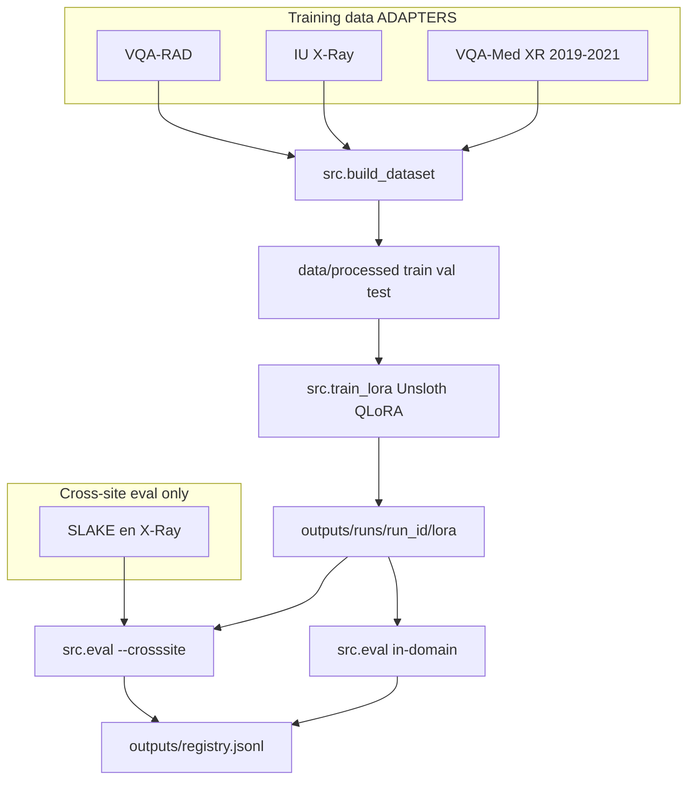

# VQA Finetuning Project — Development Report

**Generated:** 2026-07-09  
**Repository:** `vqa-finetuning`  
**Primary reference run:** [`full-Qwen3VL4BInstruct-r16-20260709-142243`](outputs/runs/full-Qwen3VL4BInstruct-r16-20260709-142243)

---

## 1. Executive summary

This project finetunes **Qwen3-VL-4B-Instruct** with **Unsloth QLoRA** for chest X-ray **Visual Question Answering (VQA)** and **report generation** using a portable, config-driven pipeline on WSL with dual 12 GB GPUs.

Development to date includes:

- End-to-end pipeline (data import → unified JSONL → LoRA training → in-domain eval → model registry)
- **Three training datasets** integrated via pluggable adapters
- **One held-out cross-site dataset** (SLAKE) for external generalization testing
- Automated experiment tracking (`outputs/registry.jsonl`, `outputs/leaderboard.md`)
- Post-training hooks for in-domain eval (`--eval-after`) and cross-site eval (`--crosssite-after`)

The current **flagship full training run** (`full-Qwen3VL4BInstruct-r16-20260709-142243`) trains on **VQA-RAD + IU X-Ray + VQA-Med (chest X-ray)** with task balancing and is evaluated on **1,179 frozen test examples** (`data_version: 2e673c1d`), achieving **+4.6 pp VQA accuracy** and **+8.1 pp VQA F1** over the frozen base on the expanded test set. Report generation improves by **+6.4 BLEU** and **+14.9 ROUGE-L**. Cross-site eval on **2,122 SLAKE** English chest X-ray questions shows **39.4% accuracy** (base model: **54.1%**), indicating a generalization gap on held-out external data.

---

## 2. System architecture



**Design principles:**

| Principle | Implementation |
|-----------|----------------|
| Pluggable sources | `src/datasets_registry.py` — `ADAPTERS` (training) vs `CROSSSITE_ADAPTERS` (eval-only) |
| No data leakage | Official splits honored; `study_id`-level carving; frozen `data_version` hash on test set |
| Comparable benchmarks | Baseline cached per `(base_model, data_version)`; deltas logged in registry |
| Portability | Relative paths, HF cache under `data/hf_cache/`, WSL-compatible (`UNSLOTH_COMPILE_DISABLE`) |

---

## 3. Development timeline

| Phase | Deliverable | Status |
|-------|-------------|--------|
| **1. Scaffold** | Repo layout, `requirements.txt`, `configs/train.yaml`, `src/` + `scripts/` | Done |
| **2. Environment** | `scripts/setup_env.sh` — venv, CUDA torch, Unsloth on WSL | Done |
| **3. Data adapters** | `load_vqa_rad`, `load_iu_xray` → unified JSONL schema | Done |
| **4. Dataset builder** | `src/build_dataset.py` — splits, `stats.json`, `data_version` | Done |
| **5. Training** | `src/train_lora.py` — QLoRA via `FastVisionModel` + `SFTTrainer` | Done |
| **6. Evaluation** | `src/eval.py` — VQA acc/F1, report BLEU/ROUGE-L, baseline comparison | Done |
| **7. Model registry** | `src/registry.py`, `scripts/leaderboard.py`, per-run artifact dirs | Done |
| **8. Smoke validation** | `scripts/run_smoke.sh` — 200-sample end-to-end on GPU 0 | Done |
| **9. Full training run (2-source)** | `full-Qwen3VL4BInstruct-r16-20260708-170640` on 3,688 train rows | Done |
| **10. Cross-site eval** | SLAKE pipeline (`src/build_crosssite.py`, `scripts/eval_crosssite.sh`) | Done |
| **11. VQA-Med integration** | `src/vqa_med_io.py`, `load_vqa_med`, chest X-ray filter, 3rd training source | Done |
| **12. Task balancing** | `balance_tasks: true` — 60/40 VQA/report mix on full training | Done |
| **13. Full training run (3-source)** | `full-Qwen3VL4BInstruct-r16-20260709-142243` on 4,725 train rows + SLAKE cross-site | Done |

---

## 4. Datasets

### 4.1 Training datasets (3 sources)

These are registered in `ADAPTERS` and flow into `data/processed/{train,val,test}.jsonl`.

| # | Source key | Dataset | Task | Access | Filter / notes |
|---|------------|---------|------|--------|----------------|
| 1 | `vqa_rad` | [VQA-RAD](https://huggingface.co/datasets/flaviagiammarino/vqa-rad) | VQA | Open | Radiology Q&A; official train/test |
| 2 | `iu_xray` | [IU X-Ray](https://huggingface.co/datasets/dz-osamu/IU-Xray) | Report | Open | Chest X-ray findings; zip/image fallback |
| 3 | `vqa_med` | ImageCLEF VQA-Med 2019–2021 | VQA | Open | **Chest X-ray / plain film only**; 2020 train via AIcrowd zip |

#### Rows used in the reference full run (`data_version: 2e673c1d`)

The current flagship run `full-Qwen3VL4BInstruct-r16-20260709-142243` uses all three training sources with task balancing:

| Split | Total | Notes |
|-------|-------|-------|
| **Train** (balanced) | **4,725** | 60% VQA / 40% report after `balance_tasks` |
| **Test** (in-domain eval) | **1,179** | Frozen test; includes VQA-Med XR slice |
| **`data_version`** | `2e673c1d` | — |

Per-source in-domain VQA on the 1,179-example test set (finetuned model):

| Source | VQA acc | VQA F1 | Base acc | Base F1 | Δ acc |
|--------|---------|--------|----------|---------|-------|
| **VQA-RAD** | 0.5144 | 0.3616 | 0.4723 | 0.2638 | **+4.2 pp** |
| **VQA-Med (XR)** | 0.0725 | 0.0938 | 0.0145 | 0.0374 | **+5.8 pp** |
| **IU X-Ray** (report) | — | — | — | — | BLEU/ROUGE only |

#### Previous full run (`data_version: 91e79275`) — 2 sources only

Run `full-Qwen3VL4BInstruct-r16-20260708-170640` predates VQA-Med:

| Split | Total | VQA-RAD (VQA) | IU X-Ray (report) |
|-------|-------|---------------|-------------------|
| **Train** | **3,688** | 1,619 | 2,069 |
| **Val** | 470 | 174 | 296 |
| **Test** (in-domain eval) | **1,041** | 451 | 590 |
| **Total** | **5,199** | 2,244 | 2,955 |

---

### 4.2 Cross-site dataset (1 source — eval only)

Held out from training. Registered in `CROSSSITE_ADAPTERS` only.

| # | Set name | Dataset | Rows | Images | Filter |
|---|----------|---------|------|--------|--------|
| 1 | `slake_xray_en` | [Keetawan/SLAKE](https://huggingface.co/datasets/Keetawan/SLAKE) | **2,122** | **179** | English + chest X-ray only |

| Metric | Value |
|--------|-------|
| `crosssite_version` | `a332b51b` |
| Closed QA | 663 |
| Open QA | 1,459 |
| Output | `data/crosssite/slake_xray_en.jsonl` |

Cross-site scores measure **generalization** to an external institution/question mix. They do not affect `data_version` or in-domain `metrics.json`.

---

## 5. Reference run: `full-Qwen3VL4BInstruct-r16-20260708-170640`

### 5.1 Run configuration

| Field | Value |
|-------|-------|
| **Run ID** | `full-Qwen3VL4BInstruct-r16-20260708-170640` |
| **Base model** | `unsloth/Qwen3-VL-4B-Instruct` |
| **Method** | 4-bit QLoRA |
| **LoRA** | r=16, alpha=32 |
| **Learning rate** | 2e-4 |
| **Epochs** | 2 |
| **Task mix** | 60% VQA / 40% report |
| **Training sources** | `vqa_rad`, `iu_xray` |
| **Train examples** | 3,688 |
| **Eval examples** | 1,041 (full frozen test) |
| **`data_version`** | `91e79275` |
| **GPU** | 0 |
| **Git commit** | `bfde551` |
| **Started** | 2026-07-08 17:06:40 |
| **Evaluated** | 2026-07-08 21:22:23 |
| **Adapter path** | `outputs/runs/full-Qwen3VL4BInstruct-r16-20260708-170640/lora/` |

### 5.2 Training time

| Phase | Duration |
|-------|----------|
| **LoRA training** | **52.2 minutes** (~3,131 s) |
| In-domain eval (1,041 test rows) | ~several hours (GPU 1; generation-bound) |
| Cross-site eval (SLAKE) | Not run on this full run |

Training time is recorded in the registry as `train_minutes: 52.17`.

### 5.3 In-domain metrics (frozen test set)

| Metric | Finetuned | Frozen base | **Δ (finetuned − base)** |
|--------|-----------|-------------|--------------------------|
| **VQA accuracy** | **0.5499** | 0.4723 | **+0.0776** |
| **VQA F1** (open-ended) | **0.3800** | 0.2638 | **+0.1162** |
| **Report BLEU** | **0.0743** | 0.0108 | **+0.0635** |
| **Report ROUGE-L** | **0.2656** | 0.1165 | **+0.1491** |

**Interpretation:**

- VQA improved by ~**8 percentage points** exact-match accuracy on the combined VQA-RAD test split.
- Report generation improved substantially on BLEU/ROUGE-L from a very weak base (expected for untrained VLMs on long-form radiology text).
- This run did **not** include VQA-Med in training or test; a rebuild with `vqa_med` will produce a new `data_version` and non-comparable headline numbers.

### 5.4 Artifacts

```
outputs/runs/full-Qwen3VL4BInstruct-r16-20260708-170640/
├── config.snapshot.yaml    # frozen hyperparameters
├── run.json                # run metadata
├── metrics.json            # in-domain benchmarks + baseline
├── train.log               # training log
└── lora/                   # saved LoRA adapter + tokenizer
```

---

## 6. Other completed runs (summary)

| Run ID | Type | n_train | n_eval | Train (min) | VQA acc | Δ acc | Notes |
|--------|------|---------|--------|-------------|---------|-------|-------|
| `smoke-…-162605` | Smoke | 200 | 40 | 1.75 | 0.50 | +0.05 | Cross-site SLAKE 50-sample eval done |
| `smoke-…-163050` | Smoke | 200 | 40 | 5.18 | 0.55 | +0.10 | — |
| `smoke-…-20260709-124448` | Smoke | 200 | 40 | 1.78 | 0.25 | +0.00 | Includes `vqa_med` (partial build) |
| **`full-…-170640`** | **Full** | **3688** | **1041** | **52.17** | **0.55** | **+0.08** | **Primary benchmark run** |

Full leaderboard: [`outputs/leaderboard.md`](outputs/leaderboard.md)

---

## 7. Pipeline capabilities (current)

| Feature | Command / module |
|---------|------------------|
| Build all training data | `bash scripts/download_data.sh --sources vqa_rad iu_xray vqa_med` |
| Full train + eval + cross-site | `bash scripts/run_full.sh --eval-after --crosssite-after --crosssite-name all` |
| Cross-site only | `bash scripts/eval_crosssite.sh <run_id>` |
| Probe VQA-Med filter | `python scripts/probe_vqa_med.py` |
| Leaderboard | `python scripts/leaderboard.py` |
| Per-source eval breakdown | `vqa_acc_by_source` in `metrics.json` (newer runs) |

---

## 8. Planned future datasets

From the original [`vlm_report_vqa_plan.md`](vlm_report_vqa_plan.md) and current architecture. Each requires only a new loader + one line in `ADAPTERS` or `CROSSSITE_ADAPTERS`.

### 8.1 High priority (open)

| Dataset | Role | Rationale |
|---------|------|-----------|
| **VQA-Med 2020 train** (AIcrowd) | Training VQA | Completes ImageCLEF 2019–2021; adapter already supports manual zip drop-in |
| **PMC-VQA / ROCO** | Training VQA | Large-scale open medical VQA for diversity |
| **SLAKE (training split)** | Optional training VQA | Currently cross-site only; could add train portion if eval split is redesigned |

### 8.2 Credentialed / closed (future, optional)

| Dataset | Role | Access |
|---------|------|--------|
| **MIMIC-CXR** | Report generation scale (~227k) | PhysioNet credentialing |
| **MIMIC-CXR-VQA** | VQA scale | PhysioNet credentialing |

Integration path: convert to unified JSONL with `"access": "closed"`, `"source": "mimic"` — no pipeline schema changes.

### 8.3 Augmentation & semi-open

| Dataset / technique | Role |
|---------------------|------|
| **PadChest** | Reports + labels (registration required) |
| **CheXpert / NIH labels** | Weak supervision, auxiliary tasks |
| **Bounding boxes** | Localization VQA (“where is X?”) |
| **LLM-generated Q&A from IU reports** | Cheap VQA scaling from existing report data |

### 8.4 Evaluation enhancements (planned)

| Item | Description |
|------|-------------|
| CheXbert / RadGraph F1 | Clinical report metrics (mentioned in original plan) |
| Per-source leaderboard columns | Already partially implemented (`vqa_acc_by_source`) |
| Dedicated VQA-Med test slice | Track in-domain VQA-Med generalization after full rebuild |

---

## 9. Recommended next steps

1. **Full rebuild** with all three training sources (no `--limit`):
   ```bash
   bash scripts/download_data.sh --sources vqa_rad iu_xray vqa_med
   ```
2. **Add VQA-Med 2020 AIcrowd train zip** to `data/raw/vqa_med/downloads/` for maximum VQA-Med coverage.
3. **Retrain** with post-training eval:
   ```bash
   bash scripts/run_full.sh --eval-after --crosssite-after --crosssite-name all
   ```
4. Compare new `data_version` against `91e79275` using per-source metrics (`vqa_acc_by_source`).
5. Pursue **MIMIC-CXR** access when credentialed data is required for production-scale report generation.

---

## 10. References

- VQA-RAD: [flaviagiammarino/vqa-rad](https://huggingface.co/datasets/flaviagiammarino/vqa-rad)
- IU X-Ray: [dz-osamu/IU-Xray](https://huggingface.co/datasets/dz-osamu/IU-Xray)
- VQA-Med: [ImageCLEF VQA-Med](https://www.imageclef.org/2021/medical/vqa)
- SLAKE: [Keetawan/SLAKE](https://huggingface.co/datasets/Keetawan/SLAKE)
- Unsloth: [unsloth/Qwen3-VL-4B-Instruct](https://huggingface.co/unsloth/Qwen3-VL-4B-Instruct)

---

*This report reflects the repository state as of 2026-07-09. The reference full run predates VQA-Med training integration; dataset counts in Section 4.1 distinguish “used in run” vs “available after full rebuild.”*
